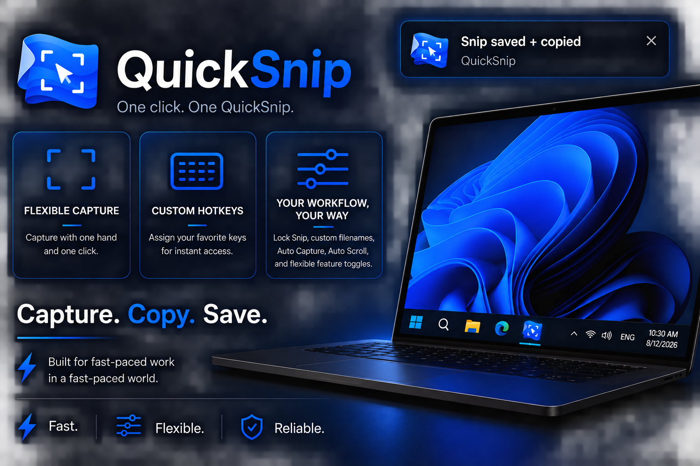

<p align="center">
  
</p>

<h1 align="center">QuickSnip for Windows</h1>

<p align="center"><strong>One click. One QuickSnip.</strong></p>

<p align="center">
  
</p>

QuickSnip is a lightweight native Windows screenshot utility built for fast-paced work. Capture, copy, and save without interrupting your workflow.

Current build: **0.10.0**

## Focus features

### Flexible Capture

Capture with one hand and one click. Choose **Drag Snip**, **Screen Snip**, or **Window Snip**, then decide which mode launches from the taskbar. Alternate modes remain available from the right-click Jump List when enabled.

### Custom Hotkeys

Assign your preferred global shortcuts for instant access to each capture mode. QuickSnip registers changes immediately, detects conflicts, and keeps the previous working shortcut when a combination is unavailable.

### Your Workflow, Your Way

Use **Lock Snip** to keep one application window targeted while you work elsewhere. Combine manual capture, Auto Capture, and Auto Scroll; choose custom filenames and save locations; and independently control saving, clipboard output, taskbar modes, and capture feedback.

**Capture. Copy. Save.**<br>
Built for fast-paced work in a fast-paced world.

**Fast. Flexible. Reliable.**

## Capture modes

- **QuickSnip** captures the display containing the mouse pointer.
- **Window Snip** captures only the focused application window.
- **Drag Snip** dims the desktop and captures the area selected by dragging.

Exactly one capture mode is the left-click default. Drag Snip is the initial default. Selecting one immediately turns the other modes off, and inactive modes remain available in the taskbar right-click Jump List. If the active mode is turned off without selecting another, Drag Snip is restored immediately.

Drag Snip uses left-drag to select. Press `Esc` or right-click to cancel without saving or changing the clipboard.

## Output and recovery

- Save PNG, JPEG, or WebP files.
- Choose Low, Medium, or High quality for JPEG and WebP.
- Copy the image to the Windows clipboard.
- Choose a custom save folder.
- Show a compact branded “Snip taken” toast, enabled by default and configurable.
- Move QuickSnip images to the Windows Recycle Bin after confirmation.
- Reset window placement or restore preferences without deleting screenshots.
- Choose mode/date, date-only, window/date, or exact custom filenames with collision-safe suffixes.

Save and clipboard output can be enabled independently, but at least one output must remain enabled. The default folder is `Pictures\QuickSnip`.

## Global hotkeys

QuickSnip supports separate custom global shortcuts for Drag Snip, QuickSnip, and Window Snip. They are unassigned by default. Click a field in Settings and press a combination containing Ctrl, Alt, Shift, or the Windows key.

- Conflicting system-wide shortcuts are rejected without replacing the previous working shortcut.
- Changes register immediately; no restart is required.
- Individual shortcuts can be cleared, or all can be reset together.
- When any shortcut is assigned, one lightweight invisible QuickSnip process runs in the background and starts automatically at Windows sign-in.
- Clearing every shortcut removes the startup entry and stops the background host after Settings closes.

## Taskbar behavior

- Left-click QuickSnip to run the enabled default capture mode.
- Right-click QuickSnip for Window Snip, Open Snips Folder, and QuickSnip Settings.
- QuickSnip Settings uses compact toggle rows inspired by the original browser-extension popup.

## Lock Snip

Lock Snip keeps one selected application window as its capture and scrolling target while you continue working elsewhere. Its floating controller provides Up, Down, Capture, Reset Window, Auto Capture, Auto Scroll, Stop, and Close actions. Every capture is immediately saved, copied according to Output preferences, and confirmed by the optional toast.

- Window Snip's shortcut is reused for Lock Snip capture.
- Scroll Up and Scroll Down have configurable shortcuts.
- Auto Capture responds only to downward scrolling. Auto Scroll runs only after a successful capture; enabling both creates a capture-and-scroll loop until Stop is pressed.
- Chrome supports background scrolling; File Explorer uses a focused scrolling fallback that restores the previous window and pointer.
- Lock Snip is optional and loads only during an active session.
- Middle-click closes the controller.

## Progress so far

QuickSnip has progressed through its initial Windows builds:

- **0.1.0 — Native proof:** captured the display, copied an image to the Windows clipboard, saved a PNG, and exited silently.
- **0.2.0 — Taskbar-ready:** added a self-contained executable, stable per-user installation, icon, Start Menu shortcut, and pinning workflow.
- **0.3.0 — Jump List:** added Open Snips Folder and the first settings/actions window while preserving one-click capture.
- **0.4.0 — Reliability:** added onboarding, overlap protection, collision-safe filenames, diagnostics, and physical-pixel multi-monitor capture.
- **0.5.0 — QuickSnip:** renamed RightSnip, added Window Snip, persistent output preferences, adaptive taskbar commands, and the blue extension-inspired Settings and Information design.

- **0.6.0 — Drag and scalable windows:** added area selection plus resizable Settings and Information views that share the same remembered size and location.

- **0.7.0 — Output and distribution:** adds image formats, quality choices, compact capture feedback, recovery controls, final Drag Snip polish, and a normal Windows installer.

- **0.8.0 — Custom hotkeys and design:** adds opt-in global shortcuts, conflict handling, conditional background startup, Drag Snip defaults, and a unified richer-blue interface.

- **0.8.1 — Placement maintenance:** stabilizes the Drag Snip instruction pill on the primary display.

- **0.9.0 — Lock Snip:** adds locked display/window capture, controlled scrolling, immediate output, shared hotkeys, taskbar-mode controls, and refined typography.

- **0.10.0 — Naming and Lock Snip automation:** adds friendly filename choices, Window-only Lock Snip targeting, Up/Down controls, linked Auto Capture/Auto Scroll, and an explicit Stop action.

The original Chrome-extension investigation established why a native app was needed: Chrome can capture protected pages such as `chrome://` through extension APIs, but browser clipboard restrictions can prevent the captured image from being copied. The Windows app performs capture, clipboard, and saving outside those browser restrictions.

### Build 0.8.1 maintenance update

Drag Snip now keeps its instruction pill centered near the top of the primary display, including when capture is launched from another display. QuickSnip re-applies this placement after rendering and DPI changes. Launch-display placement is deferred until it can be tested across more multi-monitor arrangements.

## Build

```powershell
cd C:\path\to\quicksnip-exe
dotnet build .\QuickSnip.csproj
```

## Publish and install

```powershell
.\scripts\Publish.ps1
.\scripts\Install.ps1
```

Build the normal installer and portable ZIP with:

```powershell
.\scripts\PackageRelease.ps1
```

Release outputs:

- `QuickSnip-Setup-0.10.0-win-x64.exe`
- `QuickSnip-Portable-0.10.0-win-x64.zip`

The self-contained executable is installed at:

```text
%LOCALAPPDATA%\Programs\QuickSnip\QuickSnip.exe
```

The installer creates Start Menu and Windows Installed Apps entries and supports clean per-user upgrades and uninstall. Settings, logs, `Pictures\QuickSnip`, and legacy `Pictures\RightSnip` screenshots are preserved. Search Start for **QuickSnip** and choose **Pin to taskbar**.

## Diagnostics

Failures are logged silently at:

```text
%LOCALAPPDATA%\QuickSnip\Logs\quicksnip.log
```

## Current limitation

Saved window placement is validated against the connected virtual desktop and kept away from screen edges. Pointer-monitor automatic placement remains deferred; first use still opens at a comfortable centered size.
